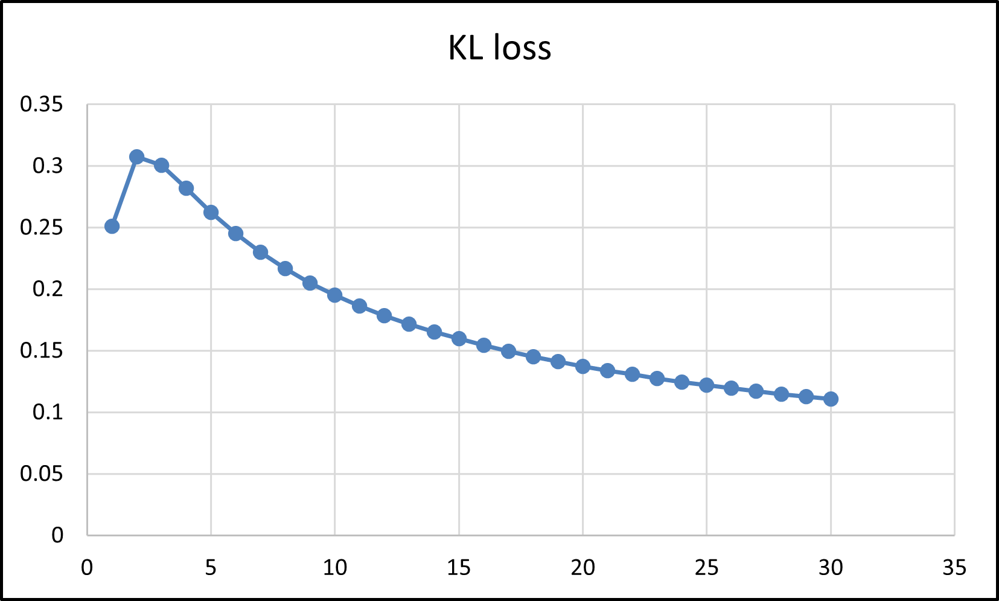
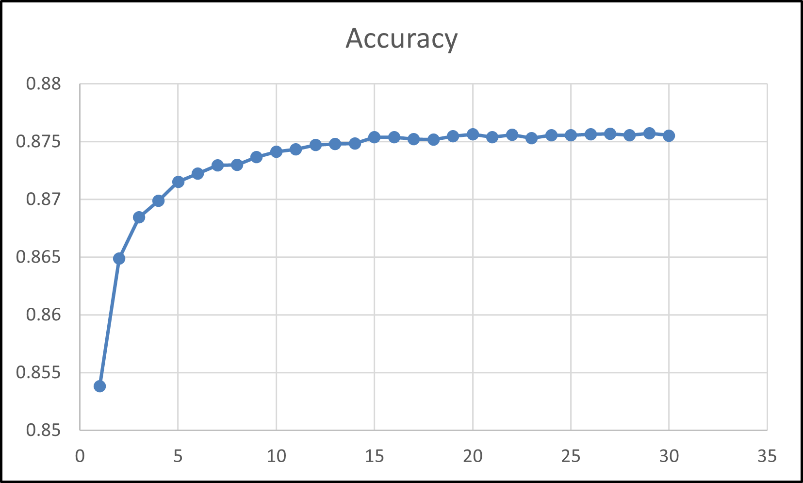
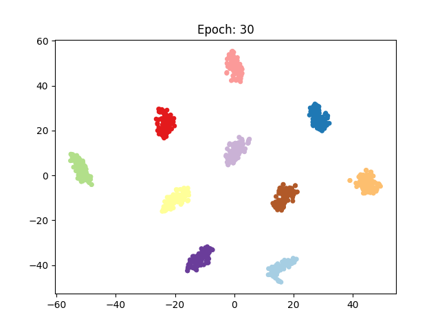

# Overview
original paper -> [Unsupervised Deep Embedding for Clustering Analysis](https://www.bing.com/search?q=Unsupervised+Deep+Embedding+for+Clustering+Analysis&form=ANNTH1&refig=3b7a5c033c41457db6af0ebf56b3250a)

# Clustering Result
- __MNIST__  
Accuracy of training data -> 87.57%  
Accuracy of test data     -> 87.50%
<table>
  <tr>
    <td></td>
    <td></td>
  </tr>
</table>

<table>
  <tr>
    <td></td>
    <td></td>
  </tr>
</table>

# Usage
```
python train.py -bs 256 -k 10 -pre_epoch 30 -epoch 30 -seed 1000
```
